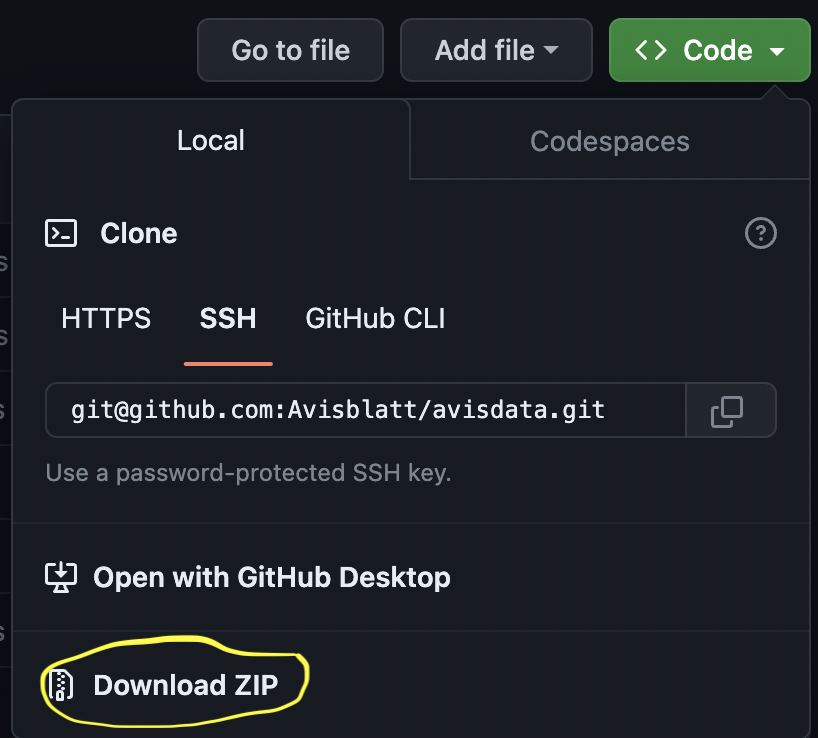

# {avisblatt} R package - Read & Process Data from Printed Markets - The Basel Avisblatt (1729-1845)

“Printed Markets” is a Swiss research project (see also [avisblatt.ch](https://avisblatt.ch)) on a new form of marketplace that emerged in Europe during the seventeenth and, for the most part, in the eighteenth century: the printed advertising market of the so-called “Intelligenzblätter” (intelligencers). Using the example of the Basel Avisblatt (published 1729-1844/45), “Printed Markets” employs digital history and data science methods to systematically open up an extensive serial source, to shine a light on the socioeconomic transformations of the “Sattelzeit”: The Avisblatt reflects myriads of ways to organise economic exchange, to interlink persons of complementary interests, to spin the socioeconomic web of a town in transition, from early modernity to the industrial age.

“Printed Markets” is a project of the Department of History at the University of Basel and is financed by the Swiss National Science Foundation SNSF. The project is led by Prof. Dr. Susanna Burghartz.


## Getting Started 

The Avisblatt project makes over 116 years of ads accessible in machine friendly
fashion. The proejct does not stop at scanning and images, but provides far more 
than 100'000 text recognized (OCR) ads and enhances these ads with a wide range
of meta information. This additional information categorizes ads, adds 
information obtained through digital text processing methods as well as relations
to other ads. 


### Installation of from GitHub

Assuming you have a working installation of R and state-of-the-art IDE such 
as RStudio or Visual Studio Code going, use `install_github` from the 
{devtools} R package to install the latest, bleeding-edge version of the
{avisblatt} R package. 


```
devtools::install_github("avisblatt/avisblatt")
```


>Note 1: If you have trouble installing {devtools} or are not an {avisblatt} package developer you can use the {remotes} package which has fewer dependencies and is easy to install. 


>Note 2: The above installation only needs to be performed once (and for 
package updates), the below R commands in 'Reading Data' to load the library
are necessary every time you intend to use the package.


### Installation of from CRAN (not available yet)


```
remotes::install_github("Avisblatt/avisblatt", auth_token = "YOUR_TOKEN")
```


### Reading Data (Single Years)

The Avisblatt project does not only provide the {avisblatt} R package but also 
the [avisdata](https://github.com/avisblatt/avisdata) data repository. The
data repository contains cleaned data that went through the OCR process, OCR
corrections and enrichment with meta information. While the package allows 
to reproduce all of these steps, the most common use case is to read in the
latest release of cleaned data from the avisdata repository. First, clone the 
data repository to your local machine using your favorite method, e.g., 
terminal via ssh:


```
git clone git@github.co0m:Avisblatt/avisdata.git
```

or simply download the a zipfile from GitHub if you are not familiar with git. 




In your R session, load the {avisblatt} R package and read a collection
into your session.


```r
library(avisblatt)
col <- read_collection("../avisdata/collections/yearly_1729")

```

The `col` object is a collection class that contains a `meta` slot for 
data description and a `corpus` slot for the ad text itself. 


### Reading Data & Merging Collections


```r
library(avisblatt)
ay <- 1730:1740
# path to data *without* trailing '/'
m <- gather_yearly_collections(ay, path = "../avisdata/collections")
# m is a collection that contains all data from 1730-1740
table(year(m$meta$date))

#> 1730 1731 1732 1733 1734 1735 1736 1737 1738 1739 1740 
#  3083 3500 3613 3440 4098 4183 4010 4095 4015 3968 3767 


```


### Data Analysis


## Related Reads

- [quanteda](https://quanteda.io)
- [quanteda tutorials](https://tutorials.quanteda.io)
- [quanteda cheatsheet](https://muellerstefan.net/files/quanteda-cheatsheet.pdf)

- [SO: Clustering with a distance matrix](https://stats.stackexchange.com/questions/2717/clustering-with-a-distance-matrix)
- [DiagrammeR](https://rich-iannone.github.io/DiagrammeR/#features)
